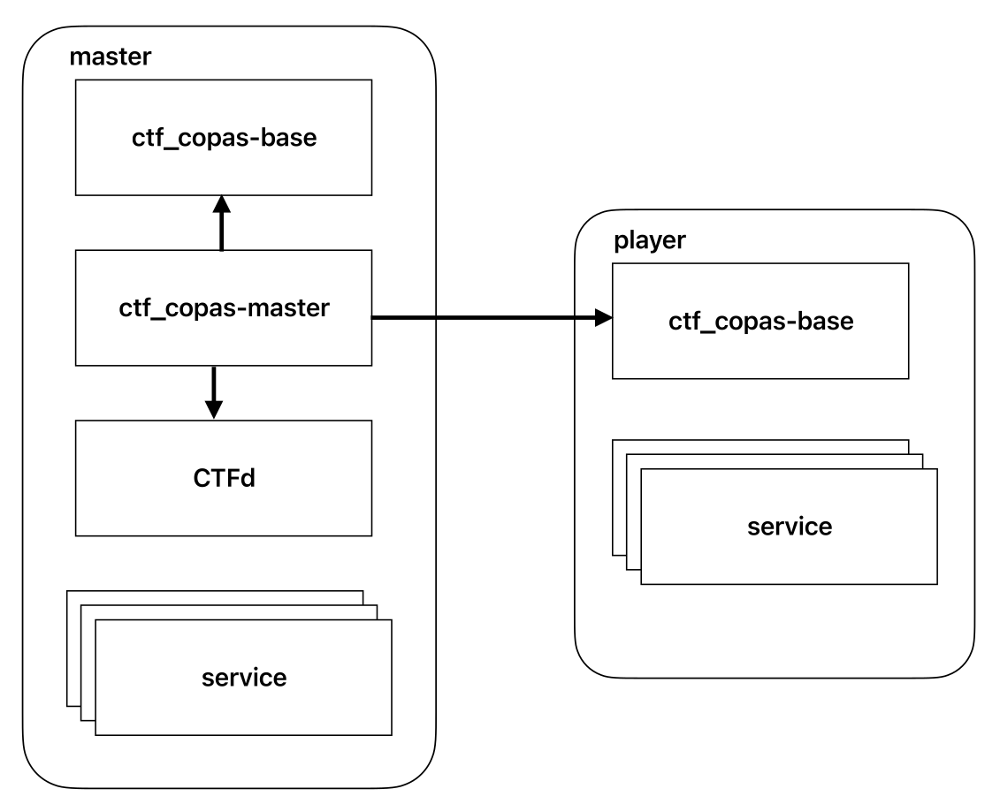
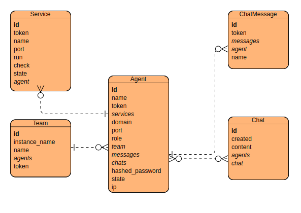

# Copas Game Infrastructure

Template for creating training games in Co-PAS. CoPAS provides its solutions in containerized form, which make
specific requirements for template. The template empowers game
designers to configure the game infrastructure, providing a flexible
framework for diverse training scenarios. A chat system is integrated
to foster communication among users during gameplay. Additionally,
the template enables the use of different Capture The Flag frameworks,
simplifying game development and game management.

## Run locally

```shell
cd backend
python3 -m venv env
source env/bin/activate
pip install poetry==1.3.2
poetry install
uvicorn app.main:app --reload
```

## Run dev frontend

```shell
cd frontend
npm install
npm run dev
```

## Run with devcontainer

Firstly, you need to create a docker network to enable communication between containers and simulate a real environment.

```shell
# create docker network to enable communication between containers and simulate real environment
docker network create copas
```

Most popular IDEs support devcontainer. Just open the project in your IDE and it will ask you to open it in
devcontainer.
Otherwise, you can use [cli tool](https://github.com/devcontainers/cli).

## Run with docker

```shell
make build
# create docker network to enable communication between containers and simulate real environment
docker network create copas
make run-master
# make run-player
```

More details in [Makefile](Makefile).

## Create a new game

1. Build a docker base image via `make build`
2. Optional - if you want to use CTFd framework you need to build it via `make build-ctfd`
3. Create a new Dockerfile in `games` directory in subdirectory with the name of the game
4. Dockerfile should inherit from selected base image(`copas` or if you want to use CTFd `copas-ctfd`)
5. Add necessary dependencies to the Dockerfile(via `apt-get`)
6. Create a [config](#config) file for the game
7. Add config file to the Dockerfile
8. Optional - create [events.py](#events) file in the game directory and `COPY` it in final docker image
9. Add game specific files to the Dockerfile
10. Build the Dockerfile
11. Optional - Run the game in case you want to add custom challenges in CTFd
    1. Initialize master
    2. Go to CTFd -> CTFd page
    3. Initialize CTFd(specify `administration` should be enough)
    4. Generate CTFd admin token (Settings -> Access Token -> Generate Access Token)
    5. Store CTFd admin token in `ctf_copas` app(CTFd -> token)
    6. Add custom challenges to CTFd (Admin panel -> Challenges)
    7. Save the game via `docker commit copas <game_name>:<tag>`
12. [Export](#export-final-game) the final game

```Dockerfile
FROM copas.ctfd:latest
COPY config.yml /app/config.yml
COPY config.yml /app/config.yml
COPY ctfd_backup.zip /ctfd/ctfd_backup.zip
COPY events.py /app/app/master/events.py
WORKDIR /workdir
ENV ROLE=master
```

## Config

In the CoPAS platform, game design revolves around a YAML configuration file that organizes and assigns roles essential
to the game's operation. This file creates an immersive scenario for players, benefiting the training purpose. The
configuration includes sections such as master, teams, services, infrastructure, and events.

### Master

Outlines unique services specific to the game organizer, dictating infrastructure elements that run exclusively
on their machine for efficient game organization and coordination.

### Infrastructure

Illustrates the fundamental groundwork required across the game environment, providing essential
instructions for setting up each agent within the CoPA system, including DNS setup and IP tables.

### Teams

Structures the multiplayer aspect, defining teams and diverse roles within each team, such as players executing
specific tasks or managing specific services.

### Services

Details specific services corresponding to various roles in a game, allowing for resource optimization and
consistency. Each service requires defined parameters like name, run command, and operating port.
To specify and start a service you can enhance [supervisord](http://supervisord.org/) which is incorporated into
the `ctf_copas`.

### Events Configuration

Events can be used to add dynamic to the game. They can be triggered at the beginning of the game or after a certain
time. More in [Events](#events).

Understanding these components is crucial for a comprehensive setup and coordination of roles and services, aligning
with the unique dynamics and requirements of each cybersecurity or infrastructure simulation.

```yaml
infrastructure:
  dns: <true|false>
  setup:
    - name: <str>
      run: <str>
master:
  services:
    - <service>
teams:
  - name: <str>
    roles:
      - name: <str>
        services:
          - <service>
services:
  - name: <str>
    run: <str>
    port: <int>
events:
  - name: <str>
    trigger: <start|time>
    timeout: optional <int>
```

### Further configuration

Project offers setting optional environmental variables to configure the game.

- `LOG_DIR`: location where will be stored log file
- `EVENTS_FILE`: where should template look for event.py file
- `PRODUCTION`: if set to `true` it will run the app in production mode
- `DEBUG`: if set to `true` it will run the app in debug mode
- `CONFIG`: location where should template look for config file
- `ROLE`: denoting that application should run under the master (`ROLE=master`)
- `HTTP_PORT`: port where the app should run
- `SERVICE_CHECK_INTERNAL`: interval in seconds for checking services
- `PING_TIMEOUT`: timeout in seconds for checking agents state
- `SNOOPY_LOG_FILE`: location where should be stored snoopy log file
- `CTFD_PORT`: port where CTFd should run

## Events

In the CoPAS gaming scenario, 'events' enhance the training experience by adding dynamism and engagement. These events
are Python functions defined in a dedicated events.py file, allowing for versatile gameplay dynamics. The 'events'
section in the configuration structure lets game designers systematically specify events through critical properties
like name and triggering conditions. There are two main event types: 'start' and 'time'. A 'start' event, triggered at
the game's beginning, serves as an initial activator. A 'time' event adds interactivity to the gameplay, requiring a '
timeout' parameter to specify triggering time intervals. The Python functions for these events must follow a specific
interface.

```python
def event_name(master: dict, teams: dict[str, dict]) -> list[dict]:
    ...
```

When you want to use [`ctfd-api`](https://pypi.org/project/ctfd-sdk/) in your events, you need to specify ctfd admin
token. `ctf_copas` provides access to the token via `get_ctfd_admin_token` function in the following snippet.

```python
import os
from pathlib import Path
from ctfd_sdk import CtfdApi

CTFD = os.getenv("CTFD", "false") == "true"
CTFD_HOST = os.getenv("CTFD_HOST", "http://localhost:8001")
CTFD_ADMIN_TOKEN = os.getenv("CTFD_ADMIN_TOKEN")
CTFD_ADMIN_TOKEN_FILE = Path(os.getenv("CTFD_ADMIN_TOKEN_FILE", "/etc/ctfd.secret"))


def get_ctfd_admin_token():
    if CTFD_ADMIN_TOKEN is not None:
        return CTFD_ADMIN_TOKEN
    assert (
        CTFD_ADMIN_TOKEN_FILE.exists()
    ), f"`CTFD_ADMIN_TOKEN not specified(inlude as env variable or in {CTFD_ADMIN_TOKEN_FILE})"
    with open(CTFD_ADMIN_TOKEN_FILE, "r") as f:
        return f.read().strip()


api = CtfdApi(get_ctfd_admin_token(), CTFD_HOST)
```

### Models

```python
master = agent = {
                     "name": < str >,
"ip": < str >,  # IP address of agent
"domain": < str >,  # agent ’s domain
"token": < str >,
"team_token": < str >,
"role": < str >,  # role assigned to agent
"port": < int >,  # port on which runs agent base server
"services": list < service >,  # services assigned to agent
"state": < up | down | unknown >,  # agent’s accessibility state
}

team = {
           "name": < str >,  # type of team
"instance_name": < str >,  # specific team name
"agents": < list[agent] >,  # agents assigned to a team
"token": < str >,
}

service = {
              "token": < str >,
"name": < str >,
"port": < int >,  # port in which service runs
"host": < str >,  # agent ’s IP address
"state": < up | down | unknown >,
"check": < str >,  # how should be service checked ( shell command )
"agent_token": < str >,
}

agent_event = {
                  "name": "<str>",  # event name(in our case it would be `event_name`)
                  "action": < str >,
"agent": < agent >
}
```

## Export final game

## Usage

When the game designer exports the game, the game organizer (master) runs the docker image with at least port 8000 open.
The master then accesses the application UI, provides their name, and if the game has a CTFd framework, they create an
access token. Players are given instructions on how to run the game and introduce themselves to the master via the UI.
They provide their name and the master's IP address, which can be found on the Master page. The game includes a chat
feature for players to share progress and cooperate. The master manages the game on the Master page, where they can
create teams, assign agents, initialize infrastructure and services, and start the game. Players can view team and
agent/service status on the Overview page.

## CTFd

[CTFd](https://docs.ctfd.io/) is a popular platform for Capture The Flag (CTF) competitions that allows users to
participate in cybersecurity
challenges, join teams, and compete for points on a real-time scoreboard. In our use-case it usually works as a scoring
system for the game. The game is divided into challenges, which are worth a certain number of points.

Challenges can be created statically before the game is build or dynamically during the game(using [events](#events)).

To communicate properly with CTFd, you need to specify the CTFd admin token in the `ctf_copas` app. Token can be created
directly in CTFd app(Settings -> Access Token -> Generate Access Token) and stored in the `ctf_copas` app(CTFd ->
token).

## Infrastructure

The CoPAS-based system architecture consists of two main components: base and master. The base component forms the
backbone of every participant's setup and handles tasks such as connecting to the master, running a front end, managing
requests from the master, and logging terminal commands. The master component is operated solely on the game organizer's
machine and oversees game setup, monitors progression, facilitates chat, and manages game-based events. It also
establishes the game infrastructure. Each machine, or agent, hosts a specific set of services corresponding to their
role within the gaming infrastructure. The master can also operate the optional CTFd framework, which provides a scoring
system for the games.



## ERD

The Entity-Relationship Diagram (ERD) of our system is based on five key entities: Team, Agent, Service, Chat, and
ChatMessage. Each Agent is assigned to a Team at the game's onset, and the Agent entity has relationships with Service,
Chat, and ChatMessage entities. The Service entity represents the services an agent is responsible for, while the Chat
and ChatMessage entities implement the chat functionality for real-time communication among Agents


